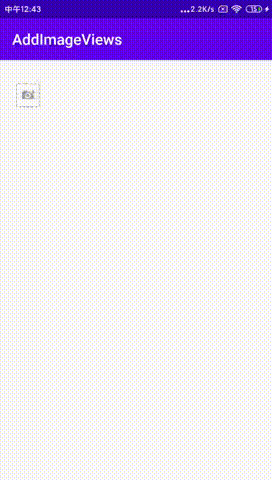

#### 效果
<p>

</p>

## 介绍
越来越多的功能需要图片上传,所以封装了一个图片选取,展示的九宫格控件.包含了添加,删除,以及预览(为方便自定义,预览只提供点击
方式外部自定义预览实现)的功能


#### 思路
* 自定义ViewGroup 包含RecycleView 实现九宫格
* 自定义属性 设置展示的行数,最大添加的个数设置AddItem 图片的展示样式,以及设置关闭按钮和错误页展示的央视
* 利用RecycleView 的 GridLayoutManager 设置九宫格展示
* 根据逻辑需要在RecyclerView.Adapter中动态添加图片和Add页面的两种不同他的Item
* 根据添加数据有没有AddItem类型动态处理数据

#### 方法介绍

##### 1.点击事件

```
//添加数据
fun addAddImages(lists: List<AddImagesInfo>) {
        mAdapter!!.addItems(lists)
    }
```
    
##### 2.点击事件
```
interface AddImagesViewListener {
        // 添加
        fun onAdd()
        //预览
        fun onPreview(item:AddImagesInfo?,lists: List<AddImagesInfo>?)
    }  
```


 
 

 


